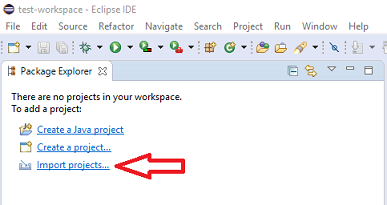
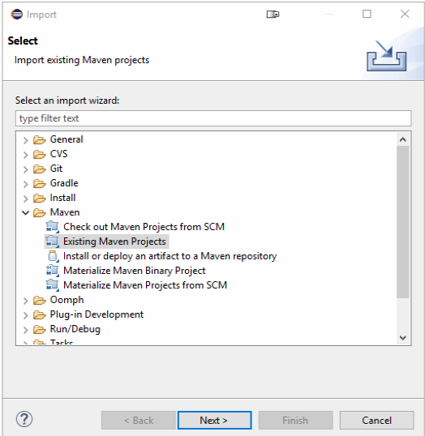
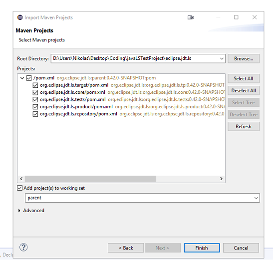
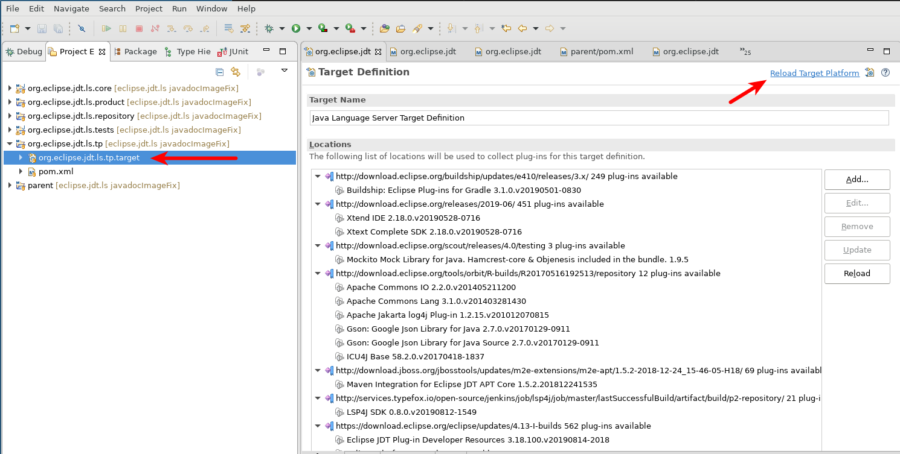
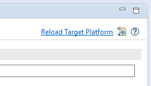

# How to contribute

Contributions are essential for keeping this language server great.
We try to keep it as easy as possible to contribute changes and we are
open to suggestions for making it even easier.
There are only a few guidelines that we need contributors to follow.

#

## Setting up the JDT Language Server
Below are the details about how to set up the JDT Language Server in different IDEs. **Notice**: You only need set up it once in any of your preferred IDE.

### A) Setting up the JDT Language Server in VS Code
1) Please install [Eclipse PDE support][1] extension in your VS Code first. The PDE extension's home page provides more usage details about _Reload Target Platform_, _Run JUnit Plug-in Test_, _Run Eclipse Application_.

2) Open VS Code on the `eclipse.jdt.ls` folder. The PDE extension will work with Java extension together to automatically load the eclipse.jdt.ls project. Check the status of the language tools on the lower right corner. It should show ready (thumbs up) as the image below.
  

### B) Setting up the JDT Language Server in Eclipse
1) In Eclipse, import a maven project:

    

    

    Select the `eclipse.jdt.ls` folder, then click yes/accept to all
following prompts:

    

2) Now we need to use Tycho to download the dependencies,
this will get rid of the errors.

	At the top right arrow it will say `Set Target Platform`, select that and continue.

	

	After it will change to `Reload Target Platform` select that:

    

3) Wait till the bottom right is done loading:

    

	once 100%:


    The errors should now be gone.

### C) Setting up the JDT Language Server in Neovim or Emacs

1) Please, download [Eclipse PDE support][1], open the `.vsix` file with a ZIP program and extract the folder `/extension/server/` into a local directory.

2) Ensure that [the initialize request][2] contains all paths to the extracted files in the [`bundles` parameter](https://github.com/eclipse/eclipse.jdt.ls/wiki/Running-the-JAVA-LS-server-from-the-command-line#initialize-request).

	If you are using [`nvim-jdtls`](https://github.com/mfussenegger/nvim-jdtls), fill the `bundles` parameter with all JARs in the extracted folder to enable PDE support.

	```lua
	config['init_options'] = {
		bundles = vim.split(vim.fn.glob("/path/to/extracted/folder/*.jar"), "\n")
	}
	```

	You might have a look at [`nvim-jdtls-bundles`](https://gitlab.com/schrieveslaach/nvim-jdtls-bundles) that automates the process for you.

	If you are using Emacs with [`lsp-java`](https://github.com/emacs-lsp/lsp-java), have a look at the configuration option `lsp-java-bundles`. For example, following configuration snippet enables PDE support:

	```
	(use-package lsp-java
		:config (setq lsp-java-bundles (directory-files "/path/to/extracted/folder/" t ".jar"))
		:hook (java-mode . lsp))
	```

#

## Pull Requests

In order to submit contributions for review, please make sure you have signed the [Eclipse Contributor Agreement](https://www.eclipse.org/legal/ecafaq.php) (ECA) with your account.

Also, please ensure that your commit contains a `Signed-off-by` field with your name and account email in the footer. This is a confirmation that you are aware of the terms under which the contribution is being provided. This can be done with the `-s` flag of the `git commit` command.

[1]: https://marketplace.visualstudio.com/items?itemName=yaozheng.vscode-pde
[2]: https://github.com/eclipse/eclipse.jdt.ls/wiki/Running-the-JAVA-LS-server-from-the-command-line#initialize-request

